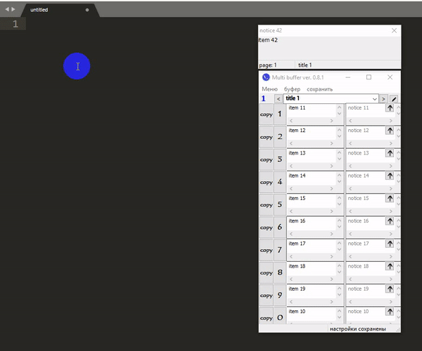
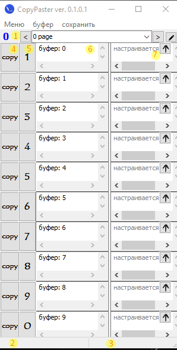
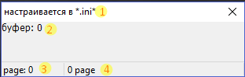

# Multiple buffering

## Описание приложения
Программа служит для хранения нескольких буферов обмена, программа может работать в фоновом режиме т.е. можно копировать\вставлять горячими клавишами сразу.
## Установка
1. Скачать последнюю версию [Multibufer.zip](https://github.com/Bizhev/multiple-buffering/raw/master/appDebug/MultiBuffer.zip)
1. Разархивировать и запустить, первый запуск длится около 2х минут

## Как пользоваться?
Нужно сначала настроить какие буфера нам нужны, после пользуемся не открывая главное окно. Программа работает в фоновом режиме. 
Например, ставим курсор где нам нужно вставить, нажимаем нужную комбинацию(ctrl + 1) и программа сразу вставляет ячейку '1'.

## Главное окно:

* 1 — Номер текущей страницы
* 2,3 — выводит об некоторых событиях, например когда текущее состояние страницы успешно сохранен.
* 4 — все кнопки "copy" всавляют содершимое поле (6) 
* 5 — текущее содержимое буфера вставляет в свою ячейку (6)
* 7 — служит пометкой для своего содержимого ячейки (6)

## Окно буфера:

* 1 — тема текущей страницы
* 2 — выводит содержимое после буфера
* 3,4 — выводит номер текщей страницы
Окно буфера обновляется только после нажатия ctrl + 0-9

## Горячие кнопки
* ctrl + 0-9 (4) — копирует в буфер обмена содержимое (6) и вставляет для windows (в консолях нужно еще нажать shift + insert) 
* ctrl + * — показывает буфер   
* ctrl + Q — переходит на предыдущую страницу 
* ctrl + E — переходит на следующую страницу
* ctrl + G — Вставляет постоянный буфер,
* ctrl + B — Вставляет текущую дату и время 
* F4, F6 — дополнительно

*  — служит для изменения темы страницы
*  — служит для перемещения ячейки на верх
